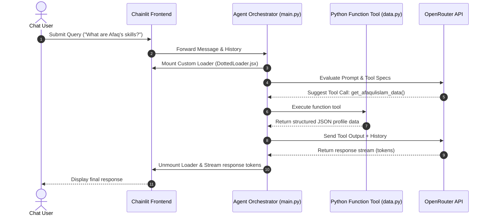

# 🤖 ChatAUI — Advanced Conversational AI Agent

<p align="center">
  
</p>

<p align="center">
  <strong>An enterprise-grade, stateful conversational AI assistant built using Chainlit, OpenAI Agents SDK, and python-dotenv. Engineered with modern package management (UV) and robust OAuth security (Google & GitHub).</strong>
</p>

<p align="center">
  <a href="https://www.python.org/">
    
  </a>
  <a href="https://docs.chainlit.io">
    
  </a>
  <a href="https://github.com/openai/openai-agents-python">
    
  </a>
</p>
<p align="center">
  <a href="https://github.com/astral-sh/uv">
    
  </a>
  <a href="LICENSE">
    
  </a>
  <a href="https://huggingface.co">
    
  </a>
</p>

---

## 📖 Table of Contents
1. [Overview](#-overview)
2. [Key Features](#-key-features)
3. [Architecture & Flow](#-architecture--flow)
4. [Tech Stack](#-tech-stack)
5. [Getting Started (Local Setup)](#-getting-started-local-setup)
6. [Project Structure](#-project-structure)
7. [Deployment (Hugging Face / Docker)](#-deployment-hugging-face--docker)
8. [License](#-license)
9. [Author & Contact](#-author--contact)

---

## 🌟 Overview

**ChatAUI** is a production-ready conversational AI agent designed to act as an interactive resume and personal assistant for **Afaq Ul Islam**. It demonstrates how to leverage modern LLM engineering paradigms like **tool calling (function calling)**, **agentic state management**, and **interactive custom UI components** in Python.

By integrating the state-of-the-art **OpenAI Agents SDK** with a sleek **Chainlit** frontend, ChatAUI delivers a fluid, token-streamed chat experience powered by flexible backend APIs (such as OpenRouter). The project is built for secure environments, leveraging OAuth 2.0 (Google and GitHub) for identity provider (IdP) authentication.

---

## ✨ Key Features

*   🤖 **OpenAI Agents SDK Integration:** Leverages declarative agent definitions and autonomous, multi-turn tool execution.
*   ⚡ **Ultra-Fast Runtime with UV:** Utilizes Astral's `uv` for lightning-fast Python dependency management, virtual environments, and reproducible builds.
*   🔄 **Real-Time Token Streaming:** Streaming responses with sub-second time-to-first-token (TTFT).
*   🔐 **OAuth 2.0 Authentication:** Built-in support for securing user sessions using GitHub and Google login providers.
*   💾 **Session-Level Chat Memory:** Remembers context across multi-turn queries using Chainlit's stateful user sessions.
*   🎨 **Custom React Elements:** Injects custom loaders (like `DottedLoader.jsx`) directly into the chat stream to enhance UX during tool execution.
*   🛠️ **Local Agentic Tools:** Integrates native Python function tools (`get_afaqulislam_data`) that safely format and retrieve localized JSON information.

---

## 📐 Architecture & Flow

The interaction between the user, frontend, agent orchestrator, and external API services is designed for performance and separation of concerns:



---

## 🧱 Tech Stack

| Category | Technology | Purpose |
| :--- | :--- | :--- |
| **Language** | Python 3.11+ | Main programming language |
| **Frontend** | Chainlit | Reactive chat UI & session state management |
| **AI Orchestration** | OpenAI Agents SDK | Agent structure, history tracking, and tool execution |
| **Model Hosting** | OpenRouter / OpenAI | API access to top LLMs (Gemini, Claude, GPT) |
| **Package Manager** | `uv` (by Astral) | Ultra-fast dependency resolution and virtual environments |
| **Authentication** | OAuth 2.0 | Google & GitHub Identity Providers |
| **UI Components** | React (JSX) | Custom loaders and UI layout modifications |
| **Deployment** | Docker | Containerized target platform |

---

## ⚙️ Getting Started (Local Setup)

To set up and run the project locally, ensure you have **Python 3.11+** installed. We recommend using **UV** for managing dependencies.

### 1. Install UV
**macOS / Linux:**
```bash
curl -LsSf https://astral.sh/uv/install.sh | sh
```
**Windows (PowerShell):**
```powershell
powershell -ExecutionPolicy ByPass -c "irm https://astral.sh/uv/install.ps1 | iex"
```

### 2. Clone the Repository & Initialize Environment
```bash
git clone https://github.com/afaqulislam/chataui.git
cd chataui
```

Create and activate a virtual environment:
```bash
uv venv
# On Windows
.venv\Scripts\activate
# On macOS/Linux
source .venv/bin/activate
```

### 3. Install Dependencies
```bash
uv pip install -r pyproject.toml
```
*(Alternatively, run `uv sync` if utilizing workspace features).*

### 4. Configure Environment Variables
Create a `.env` file in the root folder:
```ini
OPENROUTER_API_KEY=your-openrouter-api-key
OPENROUTER_BASE_URL=https://openrouter.ai/api/v1
OPENROUTER_MODEL=your-chosen-model-name

# OAuth Configuration (Optional for local testing if auth is disabled in chainlit.yaml)
OAUTH_GITHUB_CLIENT_ID=your-github-client-id
OAUTH_GITHUB_CLIENT_SECRET=your-github-client-secret
OAUTH_GOOGLE_CLIENT_ID=your-google-client-id
OAUTH_GOOGLE_CLIENT_SECRET=your-google-client-secret

# Secret key for encrypting cookie sessions
CHAINLIT_AUTH_SECRET=your-chainlit-auth-secret
CHAINLIT_URL=your_chainlit_url_here

```
*Tip: You can generate a random secure auth secret using: `chainlit create-secret`*

### 5. Launch the Application 🚀
```bash
chainlit run main.py -w
```
The application will start, typically exposing the server at `http://localhost:8000`. The `-w` flag enables hot reloading during development.

---

## 📂 Project Structure

```
chataui-app/
├── .venv/                  # Virtual environment
├── public/                 # Static assets and custom components
│   ├── elements/
│   │   └── DottedLoader.jsx# Custom React wave loader
│   ├── avatar.png          # Chatbot assistant avatar
│   ├── favicon.png         # Website favicon
│   ├── logo_dark.png       # Dark theme application logo
│   ├── logo_light.png      # Light theme application logo
│   └── theme.json          # Theme custom styling configuration
├── .env.example            # Template for environment configuration
├── .gitignore
├── LICENSE                 # MIT Open-source license
├── README.md               # Professional documentation
├── chainlit.md             # Welcome page shown on user login
├── chainlit.yaml           # Global configurations and OAuth setup
├── data.py                 # Structured resume & skills database
├── instructions.py         # System prompt & instruction manual for the agent
├── main.py                 # Main entrypoint initiating Chainlit hooks & AI Agents
├── pyproject.toml          # Declarative metadata and dependencies
└── uv.lock                 # Pinned reproducible dependency lockfile
```

---

## ☁️ Deployment (Hugging Face / Docker)

This repository is optimized for Docker-based hosting platforms, specifically **Hugging Face Spaces**, which automatically provisions SSL certificates required for secure OAuth redirection.

### Dockerfile Configuration
To build the Docker image, use the following `Dockerfile` structure:

```dockerfile
FROM python:3.11-slim

WORKDIR /app

# Upgrade pip and install build dependencies
RUN pip install --no-cache-dir --upgrade pip

# Copy project files
COPY . .

# Install dependencies directly from pyproject.toml
RUN pip install --no-cache-dir .

EXPOSE 7860

# Launch Chainlit pointing to the Space port
CMD ["chainlit", "run", "main.py", "--host", "0.0.0.0", "--port", "7860"]
```

### Production OAuth Integration
Ensure your OAuth callback URLs match the public domain of your deployment:
*   **GitHub Callback:** `https://<your-space-name>.hf.space/auth/github/callback`
*   **Google Callback:** `https://<your-space-name>.hf.space/auth/google/callback`

---

## 📄 License

This project is licensed under the MIT License - see the [LICENSE](LICENSE) file for details.

---

## 🧑‍💻 Author & Contact

**Afaq Ul Islam**
*   **Role:** Frontend Developer | SEO Specialist | Agentic AI Developer
*   **Website:** [https://afaqulislam.github.io](https://afaqulislam.github.io)
*   **LinkedIn:** [linkedin.com/in/afaqulislam](https://www.linkedin.com/in/afaqulislam)
*   **GitHub:** [github.com/afaqulislam](https://github.com/afaqulislam)
*   **Email:** [afaqulislam707@gmail.com](mailto:afaqulislam707@gmail.com)

---
*Built with ❤️ utilizing the power of Python, Chainlit, and Agentic AI.*
